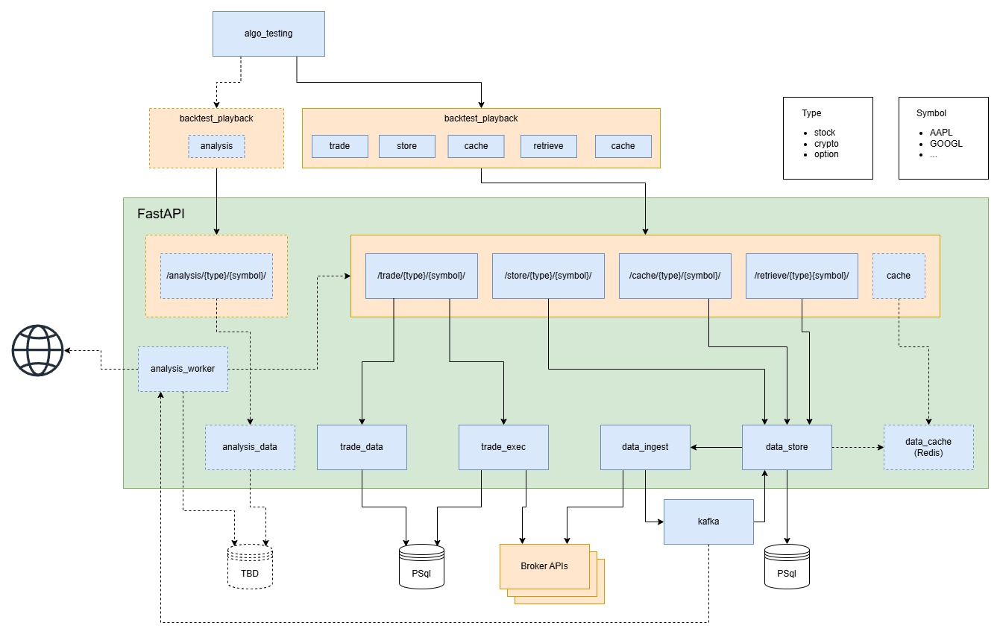

# TraderJoe
framework for testing trading algos

## Design


## Getting Started
Take a look at the `Makefile` for all the major commands.
```
# Example of launching dev container
make build
make dev-launch
```

## Database migrations

Nothing in the stack creates the schema on its own — not the container entrypoint, not the
service at startup. A stack that reports healthy still has an **empty database** until the
migrations are applied.

```
make migrate
```

**Run this after every deploy**, and after any pull that brings new revisions. It is the only
supported spelling of this step: run it by hand today, and the server deploy script will call the
same target once it exists.

Start the database first — `make launch-deps` (or `make launch`), then `make migrate`. The target
requires postgres to already be running and exits non-zero with a pointer if it is not. It will
not start the database itself on purpose: bringing the stack `up` recreates a container whose
config has changed, and a migration must never restart the database it is migrating.

The revisions applied are the ones in **this checkout**, not the ones baked into the deployed
image — `alembic.ini` and `data/store/migrations/` reach the container as bind mounts. Run it from
a checkout that matches the image you deployed.