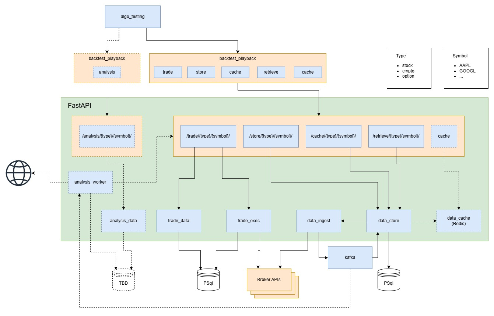

# TraderJoe
framework for testing trading algos

## Design


## Getting Started
Take a look at the `Makefile` for all the major commands. Every compose target names the stack it
means — `dev-*` builds and runs the development images (live reload, debug logging, the debugger,
source bind-mounted from this checkout, and pgAdmin), `prod-*` the production ones. Never mix a
`dev-` build with a `prod-` launch; they produce different images.

```
# Development
make dev-build
make dev-launch     # foreground, so you see the reload output; Ctrl-C stops it

# Production
make prod-build
make prod-launch    # detached, and blocks until every service reports healthy
make migrate        # see below — nothing else creates the schema
make prod-logs      # follow the service logs
```

Both stacks include the web UI (see [The web UI](#the-web-ui)). The builds need the pinned Node and
the web dependencies first: `make node-install` and `make web-install`.

`make dev-deps`, `make dev-launch` and `make dev-tools` create the shared dev network first (see
below); `make dev-network` does it on its own. The network is never removed by any target.

## Networks: prod publishes one loopback port

The two stacks are wired differently on purpose (decision record `tj-q9ae5u`, addendum 1).

**Prod** puts every service on named networks and publishes **no host port**, with one deliberate
exception: the web container's single port, on loopback only (see [The web UI](#the-web-ui)).

| Network | Kind | Members |
|---|---|---|
| `store_db` | internal | postgres, data_store |
| `ingest_store` | internal | data_store and data_ingest |
| `store_api` | internal, fixed name `trader_joe_store_api` (`STORE_API_NETWORK`) | data_store, client containers and the web container |
| `ingest_egress` | ordinary bridge | data_ingest only |
| `web_edge` | ordinary bridge | the web container only, because an internal network cannot publish a port |

An internal network has no gateway, so postgres and data_store have no egress and cannot be
reached from the host or the internet. data_ingest is the one component with internet access, for
the broker API. A client — a strategy container, the SDK, the system-test client — joins
`store_api`, which has a fixed name so another compose project can declare it external, and sees
data_store and nothing else. To look inside a prod stack, use `docker compose exec` or a client
container on `store_api`.

The fixed name is read from `STORE_API_NETWORK`, defaulting to `trader_joe_store_api`; only the agent
stack's generated env sets it (see [The agent-stack MCP](#the-agent-stack-mcp)), so it gets a
network of its own. In the same way, every service's env files are read from `ROOT_ENV_FILE`,
`STORE_ENV_FILE` and `INGEST_ENV_FILE`, defaulting to `.env`, `server/data/store/.env` and
`server/data/ingest/.env`; a normal launch never sets them.

**Upgrading from the layout before the monorepo split:** the per-service env files moved with their
directories, from `data/store/` and `data/ingest/` to `server/data/store/` and `server/data/ingest/`.
Compose does not find an untracked file left at the old path, and `make dev-launch` stops on it. Move
each one:

```
mv data/store/.env server/data/store/.env
mv data/ingest/.env server/data/ingest/.env
```

The root `.env` has not moved. Each service directory also carries a `.env.default` to copy from if
you never had a file.

**Dev** adds one external network, `trader_joe_devnet`, created by `make dev-network`. The dev
override attaches every stack service to it and publishes postgres, data_store and data_ingest on
**loopback only** (`127.0.0.1`), for psql, `/docs` and curl from this machine. pgAdmin and the agent
devcontainer join the same network, so a dev session reaches every service by name. A prod launch
never loads the override, so it never attaches devnet. The web container's port is the one published
by both stacks, on loopback in each.

None of this is authentication. Inside the networks, every surface except the three write routes
answers without credentials.

## The web UI

A browser UI for the dataset catalog and a per-dataset viewer (candles, volume and a paged bar table).
Its source is in [`web/`](web/README.md): a Vue 3 single-page app, built once and served as static
files.

| Stack | Launch | What runs |
|---|---|---|
| Dev | `make dev-build`, `make dev-launch` | The Vite dev server with hot reload; edits under `web/src/` appear at once. |
| Prod | `make prod-build`, `make prod-launch` | A Caddy container serving the built app. |

Both are at `http://localhost:8088/`. `WEB_PORT` in the root env file changes the port, and prod and
dev share it, so only one stack runs at a time. The port binds `127.0.0.1` only; reaching it from
another machine is a host decision (a tunnel or an overlay network), not a setting here.

**The proxy.** The browser talks to one origin. Caddy (`deploy/web/Caddyfile`) forwards
`/api/store/ui/v1/*` to data_store with the `/api/store` prefix stripped, so
`/api/store/ui/v1/datasets` becomes `/ui/v1/datasets`. Only `GET` and `HEAD` pass, only the UI routes
are reachable (not `/store/*`, `/internal/*` or `/docs`), and there is no route to data_ingest. The
instance secret is added to the proxied request inside the container, so the browser never holds it
and a browser cannot use the proxy to write. The dev proxy is not
that filter: the Vite proxy forwards everything under `/api/store`, any method and any path, strips the
prefix and never injects the secret, so a write from the dev server reaches the store without it and is
refused.
There is no login: access is network-only, so run it only where the network is trusted.

**The licence key.** The UI uses PrimeVue 5 under the PrimeUI Community licence, which needs a key.
Put it in the root env file as `VITE_PRIMEUI_LICENSE_KEY`; `.env.default` carries the name empty, and
the key is never committed. Prod bakes it into the JavaScript bundle at `make prod-build`, which the
licence allows, so **never push an image built with a key to a public registry**. Without a key the
app still builds and shows a licence notice.

**Generated TypeScript** for the UI's messages is written to `gen/proto/ts/` by `make gen-proto-ts`
and is never committed (`gen/` is gitignored). The build targets run it first. The routes the UI reads
are in [`docs/API.md`](docs/API.md).

## Dependencies and the lockfile

`uv.lock` is **frozen by default**. The `Makefile` exports `UV_FROZEN=1`, so every `uv` it runs
installs the lock exactly as committed and never re-resolves it — editing `pyproject.toml` does not
change the lock, and a new dependency does not reach the virtualenv, until you re-lock on purpose:

```
make lock    # the one deliberate re-lock; commit uv.lock with the pyproject.toml change
```

Two guards sit around that. `pyproject.toml` sets an install cooldown (`exclude-newer = "7 days"`),
so a resolve never picks a release younger than a week. And every target that can write the lock
refuses to run under a `uv` older than the version pinned in the `Makefile`, because an older `uv`
can re-resolve and overwrite the lock — reverting pinned versions and the cooldown — while every
command still exits 0.

Base images are pinned the same way. Every external image the `Dockerfile`,
`tools/agent_mcp/Dockerfile` and the agent-stack MCP's socket proxy build from is pinned as
`tag@sha256:<digest>`, so a tag that moves upstream never changes what builds. Bumping one means
changing the digest on purpose. The agent-stack MCP keeps its own list of the root `Dockerfile`'s
references (`BASE_IMAGES` in `tools/agent_mcp/stack.py`) and makes sure they are present before
every build, so the two must name the same references; a test checks that they do. The postgres
image in `docker-compose.yaml` is pinned by tag only.

## Writing data: the instance secret

Every dataset **write** route needs a shared secret; reads need nothing. Set it once per deployment:

```
echo "INSTANCE_WRITE_SECRET=$(openssl rand -hex 32)" >> .env
```

and send it on each write as the `X-Instance-Secret` header. The check fails closed: while the
variable is unset or empty, **every write is rejected** with a 401, and the service logs why.

Be clear about what this is. **The secret authenticates the deployment, not the caller.** Each
dataset records an `owner` — the principal the caller declares on the request — and a write naming the
wrong owner is refused. But with one key there is effectively one principal: anyone holding the key
can declare any owner. The owner check protects against mistakes, not against a holder of the key, and
it does nothing for the services' other surfaces, which answer anyone who can reach them — any
container on the stack's networks, or this machine's loopback in dev. `docs/API.md` has the full
contract.

**Expiry is optional, and no expiry means the dataset never expires.** A request that omits `expiry`
(or sends `null`) stores none. Before this release an omitted `expiry` defaulted to one day after the
request, so a client that relied on that default now gets a dataset that never lapses; send an
explicit `expiry` to keep the old behaviour. Repeating a request exactly reuses the stored dataset
and sets its expiry **from the new body**, so a repeat POST without an expiry **clears** a stored one,
and on a `DAILY` or `STREAM` dataset that un-retires it.

The `owner` value is kept out of the text the store renders: request-model reprs, the entry row's
repr, the bound parameters in a SQL error, and the search log line all show `<redacted>`. Two places
still carry it: Postgres's own `DETAIL` text on a constraint violation, and any code that formats the
value itself with `str()` or an f-string. The open read returns `owner` anyway, so this is log
hygiene, not secrecy.

## How market data is stored

A **dataset** is one request for data, identified by every field it was requested with: owner,
symbol, asset type, data type, source, granularity, expiry type, update type, and the start and end of
its range. Two requests that differ in any of them are two datasets, and each holds **its own copy**
of its bars — a bar belongs to exactly one dataset and is deleted with it. That makes a dataset's
contents unambiguous and its deletion a cascade, at the cost of duplicate storage when datasets
overlap. Repeating a request exactly reuses the existing dataset; overlapping one of your own datasets
without matching it is refused with the colliding id.

Every range is **half-open**, `[start, end)`: the start is included and the end is excluded. Two
ranges that only touch (one ends where the next starts) do not overlap, a bar stamped exactly at
`end` belongs to the next range, and a declared `end` that is not after `start` is refused with a 422.
A dataset's freshness (healthy, late, failed or retired) and completeness are not stored: the server
computes them on read, against a trading calendar for the dataset's source.

Bars are stored **raw**. There are no split or dividend factors on a bar, and corporate-action
adjustment on read is decided but **not built** — everything returned today is unadjusted.

## Database migrations

Nothing in the stack creates the schema on its own — not the container entrypoint, not the
service at startup. A stack that reports healthy still has an **empty database** until the
migrations are applied.

```
make migrate
```

**Run this after every deploy**, and after any pull that brings new revisions. Migrations are a
deploy step, not part of starting the stack (decision record `tj-x3ig38`). `make migrate` is the
only supported spelling of that step: run it by hand today, and the server deploy script will call
the same target once it exists.

Start the database first — `make prod-deps` (or `make prod-launch`), then `make migrate`. The
target requires postgres to already be running and exits non-zero with a pointer if it is not. It
will not start the database itself on purpose: bringing the stack `up` recreates a container whose
config has changed, and a migration must never restart the database it is migrating. For the same
reason it is not wired into any launch target: a rollback re-runs `compose up`, and a migration
hanging off that would re-apply from whichever revision directory happened to be checked out.

`make migrate` is production-shaped — it applies the revisions through the production `data_store`
service definition, in a one-off container on data_store's prod networks, which is how it reaches
postgres on `store_db`. That is still the right command on a dev stack, since both stacks share the
one postgres container, but expect it to want the production image built (`make prod-build`).

The revisions applied are the ones in **this checkout**, not the ones baked into the deployed
image — `alembic.ini` and `server/data/store/migrations/` reach the container as bind mounts. Run it from
a checkout that matches the image you deployed.

### Revisions that are not additive

Migrations here are meant to be **additive**: a revision adds, and never destroys what an earlier
column meant. When one cannot be, it says so on a line of its own in its docstring:

```
# additive-exception: <decision record id>
```

The marker means *this revision destroys schema, and the repository owner agreed to that*. The
exception is granted by the owner, not by whoever writes the migration, and the id names the record
where it was granted. Two revisions carry it today, `8f41c2d7a3b9` and `eec8f88a7443`, and in
current practice both also state, in the same docstring, what is destroyed and what `downgrade()`
does and does not restore. No record makes that a rule yet; it is the pattern to follow.

**Nothing enforces this mechanically yet.** The CI gate that would reject an unmarked non-additive
revision (`tj-aw0tuk`) has not been built. Today the marker is read by reviewers, and by one test,
which checks only that the current head revision still carries its marker.

**`eec8f88a7443` expects empty tables.** It rebuilds both market-data tables for the per-dataset
model and adds the bar's `feed` column `NOT NULL` with no default, so on a bar table that still holds
rows it **fails with a constraint error** by design. Wipe `stock_market_activity` and
`store_dataset_entry` before applying it; the revision's docstring has the procedure, including why
`docker compose down -v` does not do it here. Its `downgrade()` restores the old schema and nothing
else — feed, owner and expiry values written under it are not recoverable.

**What has been checked on real Postgres.** On 2026-09-29 the revision as it stands was applied by
`make migrate` to a wiped database on the owner's host, and the system suite then passed against
it twice (the host verification record is `tj-vhboky.14`). Its downgrade and its refusal on a
non-empty bar table are now checked by the system suite, `tests/system/test_migration_with_data.py`:
each test creates a scratch database on the same server, loads a committed seed at that seed's
revision, then upgrades or downgrades it and compares the rows with the seed's manifest. It has
passed through the agent-stack MCP; the stack's own database is never migrated by it.

### Seeds: every revision ships one

`tests/system/seeds/` holds a seed for each database revision: `<revision>.sql` (the data) and
`<revision>.json` (its manifest: revision, row counts, digests). A file named
`<revision>.<variant>.sql` is an extra, hand-written seed for a specific case and never stands in
for the canonical one. **A revision without its canonical seed fails the PR gate**
(`server/data/store/tests/test_seed_guard.py`, which runs in `make test`); only the initial revision,
`2b88043cd13c`, is exempt.

So a PR that adds a revision also needs a seed produced at the new head, by either route:

```
# Host: a fake-mode stack you can wipe (see the system suite below)
make system-launch SYSTEM_TEST_DISPOSABLE_DB=1
make migrate
make seed-dump SYSTEM_TEST_DISPOSABLE_DB=1     # DATE=YYYY-MM-DD optional; writes to output/seeds/
```

or, from an agent, the agent-stack MCP's `seed_dump` verb, which writes the pair under
`agent_mcp_seeds/<worktree>/` in the MCP's share directory. CI's System Testing job also uploads one
for every branch (below). Whichever route, the output is reviewed, then copied into
`tests/system/seeds/` and committed. `make seed-dump` writes only to `SEED_OUT`
(default `output/seeds`, git-ignored) and refuses to write under `tests/`.

### Checking what is applied

```
make migrate-status
```

Read-only: it runs `alembic current`, which reads the version table to report the revision the
database is actually at, and `alembic history`, which lists the revisions this checkout would
apply. Nothing in it writes. It goes through the same script as `make migrate`, so it needs
postgres running and fails the same way on an empty revisions directory.

Read the two answers together. Because the applied revisions come from the checkout while the
running code comes from the deployed image, the two can disagree with nothing saying so — a
database at a revision this checkout has never heard of means you are in the wrong checkout, and
a history that runs past `current` means the deploy is missing `make migrate`.

Neither answer can see *drift* — a schema changed outside Alembic. `current` reads the version
table, and a manual `DROP` leaves that table untouched, so the database reports head and is right
while the schema is wrong. For that there is a separate target:

```
make migrate-check
```

It runs `alembic check`, comparing the models against the live catalogue; a non-zero exit means
drift, or "Target database is not up to date." when the database is simply behind head. **It is not
read-only**, which is why it is not folded into `make migrate-status`: `check` does not pass
`dont_mutate=True`, so against a database that has never been migrated it creates `alembic_version`.
Against an already-migrated database it writes nothing. Two blind spots: autogenerate compares
neither enum labels nor server defaults, so a clean run is no evidence about either.

## Database shell

There is no make target for this, deliberately: it is a thin `psql` wrapper and a debugging step,
not part of the standard workflow, and a target would suggest otherwise.

```
docker compose -f docker-compose.yaml exec postgres \
    sh -c 'psql -U "$POSTGRES_USER" -d "$POSTGRES_DB"'
```

The variables are expanded **inside the container**, which is why they are in single quotes: the
credentials come from `.env` via compose, and compose does not export them into your own shell.
`-f docker-compose.yaml` for the same reason `make migrate` pins it — a bare `docker compose` also
loads the dev override. The one postgres container is shared by both stacks, so this reaches the
same database either way. With the dev stack up, a host `psql` can also connect to
`127.0.0.1:$DATABASE_PORT`; prod publishes no port, so there the command above is the way in.

`make dev-tools` starts pgAdmin as a GUI alternative, but it is reachable only through the
**development** stack: it lives in `docker-compose.tools.yaml`, which only `dev-tools` and
`dev-down` load and no `prod-*` target ever does, it reaches postgres over devnet, and it needs
`PGADMIN_EMAIL`/`PGADMIN_PASS` set. Running a production stack, the command above is your
documented way in.

## Tests and checks

| Command | What it runs |
|---|---|
| `make test` | The PR gate: every test except the `external` set, which needs live broker credentials. Scope with `PATHS=`. |
| `make lint` | ruff check and ruff format check, plus eslint and vue-tsc when `PATHS` covers `web/`, and buf when it covers `proto/`. It does not run the security scanners. |
| `make web-check` | The whole web chain, in CI's order: install, generate, lint, typecheck, test, build, audit. `make test PATHS=web` runs just vitest. |
| `make security` | bandit, semgrep and pip-audit — the same invocations as CI's Security Checks job. semgrep runs with `--error`, so a finding fails the target and the CI step. Run `make init` first: the tooling sits in a uv group the default sync omits. |
| `make test-system SYSTEM_TEST_DISPOSABLE_DB=1` | The system suite, below. |

### The system suite

`tests/system` checks the behaviours a unit test cannot: the migrated schema's constraints, the
store over real HTTP, the batch write under the driver's argument limit, the connection pool, a
dataset request through the real ingest service end to end, and each migration against seeded data.
It runs **from a client container**, `test_client` in `docker-compose.test-client.yaml`, which joins
`store_api` and `store_db` and dials data_store and postgres by service name. It never runs from the
host, which reaches neither in prod.

The stack must be in **fake mode**: data_ingest serves bars from `FakeRead` (`tests/fakes`) instead of
a broker, and the end-to-end tests fail against a real one.

```
make prod-build     # system-launch starts the prod images; it does not build them
make system-launch SYSTEM_TEST_DISPOSABLE_DB=1
make migrate
make test-system SYSTEM_TEST_DISPOSABLE_DB=1
make prod-down      # stops it; system-launch has no stop target of its own
```

`make system-launch` is the prod stack with `docker-compose.fake.yaml` on top. The overlay changes
data_ingest only: it mounts `tests/fakes` read-only, runs the test-only launcher with one worker, and
blanks the broker keys. The prod image holds no fakes, and no `prod-*` or `dev-*` target loads the
overlay. data_ingest logs a `FAKE BROKER:` warning at startup, so its logs say which mode it is in.

> **Hazard: fake mode runs in the live stack's place.** `system-launch` uses the default compose
> project and container names — the same ones `prod-launch` uses — and its postgres data lives in
> `DATA_DIR`, which `.env.default` sets to the live `./volumes/trader_joe/`. On a host
> that runs the production deployment it would recreate the live data_ingest as the fake and write
> fake bars into the live database, and `make prod-down` afterwards stops the live stack. Run it only
> where the stack and its database are disposable; `SYSTEM_TEST_DISPOSABLE_DB=1` is your claim of
> that, and nothing checks it. `make seed-dump` carries the same risk: it writes its scenario into
> whatever database the default project holds. Agents use the isolated agent stack instead.

The target does not start or migrate a stack; that choice stays with you. It **writes to the
database it reaches**, and on a host that also runs the production deployment it would join that
stack's networks, so it refuses to run unless `SYSTEM_TEST_DISPOSABLE_DB=1` says the database is
disposable. Nothing checks that claim for you. The credentials come from `.env` through compose, and
the client runs in a non-UTC timezone on purpose, so a naive-to-`timestamptz` shift shows up.
`SYSTEM_PATHS=` scopes the run.

Run it from a checkout whose directory name matches the one that launched the stack: compose
prefixes `store_db` with the project name, which defaults to that directory.

CI's System Testing job runs the same target against a throwaway stack, always in fake mode, after
checks that the compose sets still render, that data_ingest is on the fake broker, and that the
running stack enforces the network model (the test client cannot resolve data_ingest;
postgres and data_store have no egress). It then dumps a seed at the head revision and uploads it as
the `head-seed-<branch>` artifact, kept seven days, for a person to review and commit.

## Agent devcontainer

`.devcontainer/` defines the container agents work in. It joins devnet, so it reaches a running dev
stack by service name. It has no Docker: it runs the system suite only through the agent-stack MCP,
below.

It keeps its own uv environment, `.venv-devcontainer` (`UV_PROJECT_ENVIRONMENT`), separate from the
host's `.venv`. The checkout is bind-mounted in, and a shared `.venv` had each side point its Python
at an interpreter only it has, so the other side silently rebuilt it without the database groups.
The Makefile's sync marker lives inside whichever environment is active and is invalidated when that
environment's interpreter is missing, so a rebuilt environment always gets a full sync.

### The agent-stack MCP

Agents reach Docker only through the agent-stack MCP (`docker-compose.agent-mcp.yaml`), a server in
its own container that starts with the devcontainer by default: `make agent-up`, or the IDE's
host-side `initializeCommand`, runs `make agent-mcp-up` on the host. Set `AGENT_MCP=off` to skip it;
a failed start only warns. It offers fixed verbs over one isolated, credential-free compose project,
`trader_joe_agent_stack`. It cannot touch the dev or prod stacks, run an arbitrary command, image or
compose file, or read your env files. Only its socket proxy mounts the Docker socket.

| Verb | What it does |
|---|---|
| `stack_up(worktree)` | Snapshots the worktree (`root` or a worktree's name), builds the images from the snapshot and starts the stack, waiting for healthy. Every call force-recreates data_store and data_ingest, so they run the last snapshot's code — `tests/fakes` included; postgres is kept. |
| `stack_down` | Stops the stack and removes its containers and networks; its data is kept. |
| `stack_wipe` | Stops the stack and deletes its data directory, and nothing else. |
| `migrate` / `migrate_status` | `alembic upgrade head`, or the read-only `current` and `history`, from a fresh snapshot of the worktree the stack was brought up from. |
| `run_system_tests(worktree, paths)` | Runs `tests/system` (or `paths` under it) from a test client rebuilt from the snapshot. The services keep the last `stack_up`'s code, so call `stack_up` after editing anything they load. |
| `seed_dump(worktree, date?)` | Runs the seed producer against the up, migrated stack and writes `<revision>.sql` and `.json` under `agent_mcp_seeds/<worktree>/` in the share directory. |
| `logs(service, tail?)` / `ps` | One service's recent log lines; the stack's containers and their health. |

The agent stack is the base compose file plus `docker-compose.test-client.yaml`,
`docker-compose.agent-stack.yaml` and the fake-mode overlay (the Makefile's `AGENT_STACK_COMPOSE`;
only the MCP uses it), so its data_ingest always runs on the fake broker. The MCP generates the
stack's env itself: its own container names, `STORE_API_NETWORK`, a `DATA_DIR` under the stack's own
directory, and env files outside the repository. It never reads your `.env` or touches your
`DATA_DIR`.

**Kafka is gone from this repository, but not yet from the stack you will see running.**
`docker-compose.yaml` declares no broker and nothing in the source tree imports one. The MCP,
however, composes from the compose files **baked into the agent image** (`/opt/agent_mcp/compose/`),
and the pinned copy there still brings up `postgres kafka`. So `stack_up` starts four containers and
`ps` lists a `kafka` one that this checkout cannot account for. It is inert — no service connects to
it, and no test depends on it. It goes away when the agent image is rebuilt and the pinned compose
files come with it (`make agent-mcp-rebuild` on the host). Until then, expect it, and do not read it
as evidence that the repository still uses a broker.

The `stack_wipe` defect that used to be documented here — a `failed` report because clearing kafka's
data directory hit `Device or resource busy` — is **resolved**, not waived: the wipe now clears only
postgres (`DATA_MOUNTS` in `tools/agent_mcp/stack.py`).

The devcontainer reaches the MCP as `http://agent_mcp:8765/mcp` over an internal network, with a
bearer token read from `agent_mcp_token` in the MCP's share directory (`AGENT_MCP_SHARE_PATH`,
mounted at `/agent_mcp_share` in both containers; `.mcp.json`; Claude Code asks you to approve the
server on first use). The share directory lives under `/run/user/<uid>` (`$XDG_RUNTIME_DIR`) and is
wiped at logout or reboot; the MCP writes a new token on its next start, and a devcontainer left
running across that must be restarted too (`make agent-down && make agent-up`, or close and reopen it
in the IDE). The MCP never sees your Claude config directory, and `make agent-mcp-up` refuses host
paths that overlap.

| Command (host) | Effect |
|---|---|
| `make agent-mcp-up` | Starts the existing MCP containers, never re-reading the compose file; creates them only if there are none. |
| `make agent-mcp-down` | Stops the MCP and its socket proxy and keeps the containers. The agent stack is separate: stop it with `stack_down`. |
| `make agent-mcp-rebuild` | Rebuilds the image from the root checkout's working tree and recreates both containers from the current compose file. `make agent-build` runs it for you. |

The MCP keeps running after the devcontainer stops. **Rebuild** after the IDE's Rebuild Container,
or after changing what the image bakes in from the root checkout: the MCP's own code
(`tools/agent_mcp`), the compose files or the `Dockerfile`. A change to service code, tests or
`tests/fakes` in a worktree needs no rebuild — `stack_up` picks it up from its snapshot.
